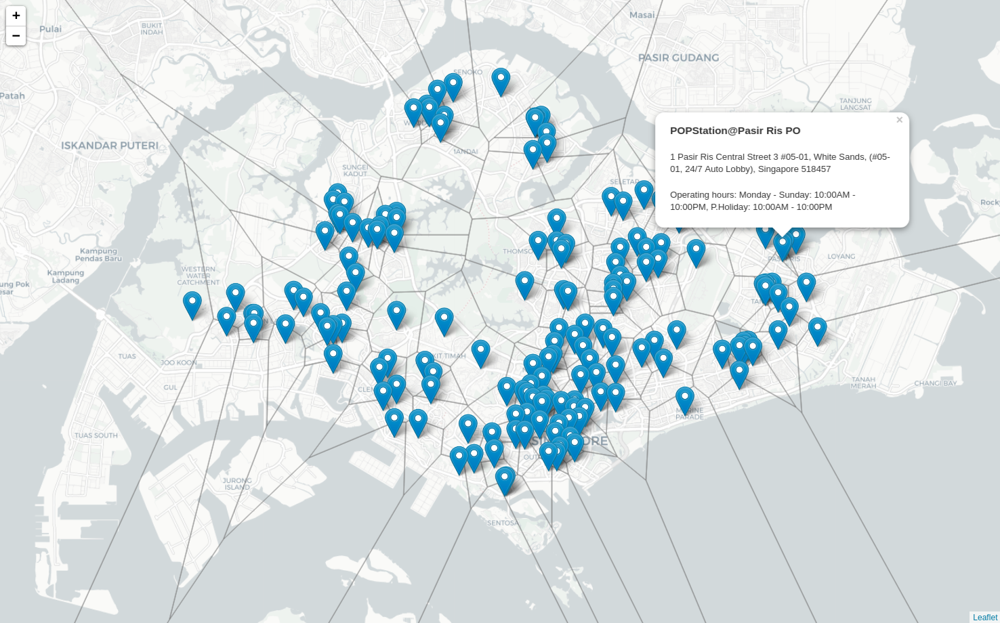

# singapore-popstation-voronoi



Singapore split by the nearest POPStation. Made with Leaflet and D3.js.


## Visiting the site

The demo can be accessed at https://halfwhole.github.io/singapore-popstation-voronoi/.

Alternatively, to run it locally on `http://localhost:8000`, you could start a
simple HTTP server:

``` python
python -m SimpleHTTPServer
```

## POPStation data

The POPStation data was retrieved by running `python3 scrape.py` on 25 May 2020.
The script will generate and update `data.json` to contain the latest POPStation
data in GeoJSON format.

## Credits

Inspiration: https://github.com/jtlx/singapore-mrt-voronoi

Data source: https://www.speedpost.com.sg/locate-us
